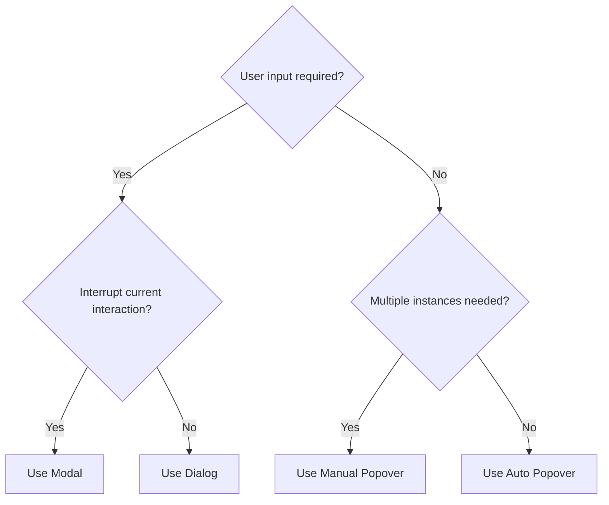

# When to Use Modal, Dialog, or Popover

With complete browser support for `<dialog>` and the `popover` API, it's crucial to understand when to use each:

- [MDN: `<dialog>` element](https://developer.mozilla.org/en-US/docs/Web/HTML/Element/dialog)
- [MDN: `popover` attribute](https://developer.mozilla.org/en-US/docs/Web/HTML/Global_attributes/popover)

## Capabilities Comparison

| Capability                  | Modal | Dialog | popover="auto" | popover="manual" |
| --------------------------- | :---: | :----: | :------------: | :--------------: |
| Dismiss on outside click    |       |        |       ✅       |                  |
| Cancel with <kbd>ESC</kbd>  |  ✅   |        |       ✅       |                  |
| Multiple instances          |       |   ✅   |                |        ✅        |
| Page interaction while open |       |   ✅   |       ✅       |        ✅        |
| Top layer rendering         |  ✅   |        |       ✅       |        ✅        |
| React 18 support            |  ✅   |   ✅   |                |                  |

### Key Considerations

1. **Auto Popover Dismissal**: `popover="auto"` dismisses when clicking outside, this can be surprising as you are dismissing a dialog, for example. Design your UX accordingly.

2. **Top Layer Behavior**: Elements in the top layer (modals, popovers) remain fixed during page scroll. Dialogs, not in the top layer, scroll with the page.

3. **React 18 Compatibility**: As of now, React 18 [doesn't support the `popover` API](https://github.com/facebook/react/issues/27479#issuecomment-2193766635).

## Decision Guide

These are general guidelines, not meant to be taken as rules. Use your best judgment for your specific use case.

### When to Use Each Type

1. **Modal**:

   - Interrupts the current interaction
   - Requires user input beyond dismissal
   - Example: Confirmation for irreversible actions

2. **Dialog**:

   - Doesn't interrupt the main interaction
   - Allows user input
   - Example: Chat window or settings panel

3. **Auto Popover**:

   - Non-interruptive
   - Single instance
   - No additional user input required
   - Dismisses on outside click
   - Example: Context menus or tooltips

4. **Manual Popover**:

   - Non-interruptive
   - Multiple instances possible
   - No additional user input required
   - Custom dismissal logic
   - Example: Notification toasts or info cards
